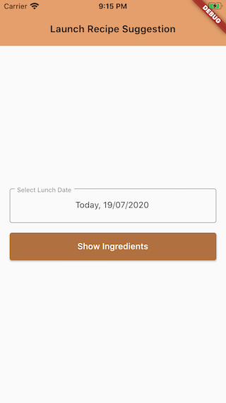
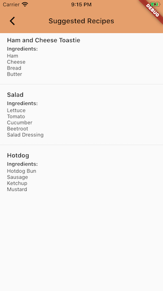

__Language :__ English | [Bahasa Indonesia](README_ID.md)

[](https://codemagic.io/apps/5f14bc9a20f1651e4a628154/5f14bc9a20f1651e4a628153/latest_build)

# Apps for Lunch Recipes Suggestion

## :open_book: How to use

#### :stethoscope: Test the app
```dart
flutter packages get
flutter test --coverage
```

#### :calling: Start the app

```dart
flutter packages get
flutter run
```
#### :hammer_and_wrench: Build the app

```dart
// Android
flutter build apk -- or -- flutter build appbundle

// iOS
flutter build ios
```

## :scroll:	Specifications

### :blue_book:	Architecture


### :books:	Libraries
| Purpose | Plugin |
| ------ | ------ |
| State Management | [flutter_bloc](https://pub.dev/packages/flutter_bloc)<br/>[bloc](https://pub.dev/packages/bloc)<br/>|
| Simplify Equality Comparisons | [equatable](https://pub.dev/packages/equatable) |
| Network API Call | [dio](https://pub.dev/packages/dio) |

### :framed_picture: Screen Capture

 
 

## Repository Created & Maintained By

### Fikri Razzaq

<a href="https://medium.com/@fikrirazzaq"></a>
<a href="https://twitter.com/fikrirazzaq"></a>
<a href="https://linkedin.com/in/fikrirazzaq"></a>

